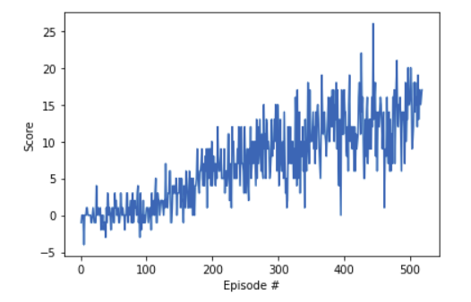

# Project Navigation


## Overview

The aim of the project is to train an agent to collect yellow bananas in a simple square environment comprising of yellow and blue bananas.

A reward of +1 is provided for collecting a yellow banana, and a reward of -1 is provided for collecting a blue banana. Thus, the goal of your agent is to collect as many yellow bananas as possible while avoiding blue bananas.

The state space has 37 dimensions and contains the agent's velocity, along with ray-based perception of objects around the agent's forward direction. Given this information, the agent has to learn how to best select actions. Four discrete actions are available, corresponding to:  
0 - move forward.  
1 - move backward.  
2 - turn left.  
3 - turn right.  

The environment for this purpose is the Banana Collector environment on the Unity ML-Agents GitHub page. The task given here is episodic. The agent is considered to be trained when it achieve average reward of 13 over 100 consequtive episodes


## Implementation Details

The problem for solved using the deep Q network with a replay buffer. The algorithm used was obtained from the paper Human-level control through deep reinforcement learning by Volodymyr Mnih et al. 


### Network Architecture


The network used for training comprised of 4 layers. The input for the network comprised of 37 different states.
Three fully connected hidden layers were used. The network is as follows  
Input - 37 states  
Layer1 - 128 neurons   
Layer2 - 64 neurons  
Layer3 - 32 neurons  
Output - 4 actions  
For all the hidden layers Relu activation functions were used. While the output is just a linear network.


### Hyperparameters

The most important hperpaparamters and their respective values used while training the network are given as follows:  

Replay buffer size = 100000  
Batch size = 64  
Discount factor(gamma) = 0.99  
Tau = 0.001 (soft update parameter)  
Learning rate = 0.0005  


## Result


The agent achieved the expected accuracy of +13 after 518 episodes of training.
The score obtained by the agent in each episode is shown below

The agent gradually learned to obtained more score over each episode and the training completed in under 10 mins

## Future work

The environment was solved rather quickly with a good overall accuracy using a simple DQN and very few linear layers. It would be interesting to try our Double DQN or priotirized experience replay. However since a simple network can solve it, it would be interesting to try out more simpler networks


```python

```
